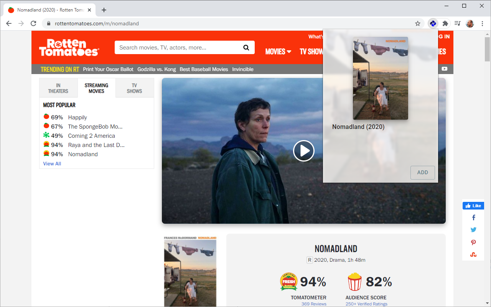

# ¡Buscarr!
Browser extension for Chrome for adding movies to [Ombi](https://github.com/Ombi-app/Ombi)'s request queue while browsing various websites. Inspired by [Pulsarr](https://github.com/roboticsound/Pulsarr).



## Supported sites
- [IMDb](https://www.imdb.com/)
- [Rotten Tomatoes](https://www.rottentomatoes.com/)
- [The Movie Database (TMDb)](https://www.themoviedb.org/)
- [Trakt](https://trakt.tv/)

## Usage

### Development
During development, the extension uses webpack dev server for hot module reloading. After starting the build, go to [chrome://extensions](chrome://extensions) and click "Load unpacked" to load the extension from the `build/` folder.

```
npm install
npm start
```

### Building
Building via `npm run build` creates a stand-alone artifact in the `build/` folder. This process also clears up any temporary files created during development, such as HMR deltas.

```
npm install
npm run build
```

## Contributing
For feature requests and bug reports, please open an [issue](https://github.com/mariotacke/buscarr/issues) with details.